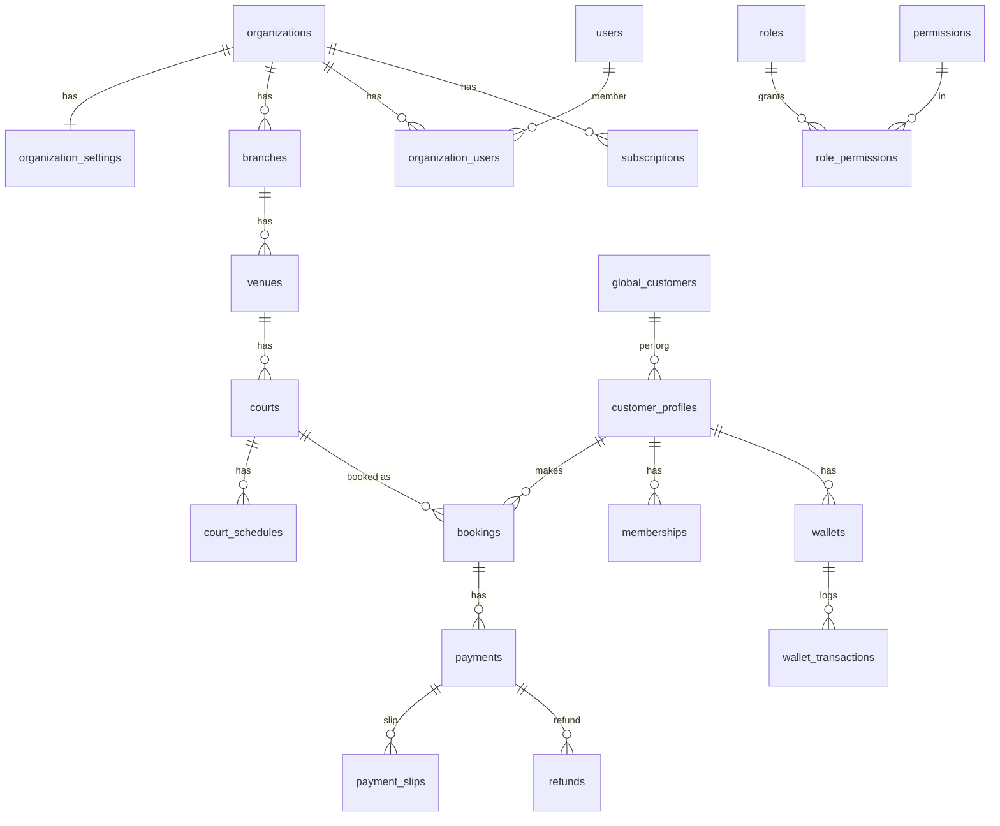

# SanamSpace — Database / ER Guide

คู่มืออธิบายโครงสร้างฐานข้อมูลของ SanamSpace (White‑Label Multi‑Tenant Sports Venue Booking SaaS)

- **สคีมาเต็ม:** [`schema.sql`](schema.sql) — MySQL 8, InnoDB, utf8mb4 · **123 ตาราง · 271 foreign keys**
- **ที่มา:** [structure/SanamSpace_Database_Architecture_v1_Full.md](../structure/SanamSpace_Database_Architecture_v1_Full.md) + [structure/SanamSpace_ER_Diagram_Master_v1.md](../structure/SanamSpace_ER_Diagram_Master_v1.md)

> หมายเหตุ: `schema.sql` คือ **canonical design ฉบับเต็ม** สำหรับ provision MySQL production
> ส่วน `backend/` (Laravel) มี migrations เฉพาะ **MVP subset** ที่แอปใช้งานจริงตอนนี้

---

## วิธีติดตั้ง

```bash
mysql -u root -e "CREATE DATABASE sanamspace CHARACTER SET utf8mb4 COLLATE utf8mb4_unicode_ci;"
mysql -u root sanamspace < database/schema.sql
```

---

## หลักการออกแบบ (Conventions)

| เรื่อง | กติกา |
|---|---|
| **Multi‑Tenant First** | ทุกตารางที่เป็นข้อมูลของสนามมี `organization_id` — แยกข้อมูลแต่ละสนาม 100% (ห้าม query ข้าม tenant) |
| **Primary Key** | UUID → `CHAR(36)` (บางตาราง lookup/warehouse ใช้ `BIGINT AUTO_INCREMENT`) |
| **Soft delete + audit** | คอลัมน์มาตรฐาน `created_at`, `updated_at`, `deleted_at` (nullable) |
| **เงิน** | `DECIMAL(12,2)` |
| **Boolean** | `TINYINT(1)` |
| **Enum/status** | เก็บเป็น `VARCHAR` + คอมเมนต์ `-- enum: ...` (ยืดหยุ่นกว่า MySQL ENUM) |
| **Engine/charset** | `InnoDB` / `utf8mb4_unicode_ci` ทุกตาราง |

**โครงลำดับชั้น (จาก architecture):**
```
PlayCourt Platform
 └─ Organization (= สนาม/ธุรกิจ)         ← organization_id อยู่ทุกที่
     ├─ Subscription → Plan → Features    (เปิด/ปิดฟีเจอร์ตามแพ็กเกจ = Feature Flag)
     ├─ Users/Staff (RBAC) + Customers (LINE)
     ├─ Branches → Venues → Courts
     └─ Bookings → Payments → ...
```
> ลูกค้า LINE คนเดียว (`global_customers`) มีได้หลาย `customer_profiles` (คนละสนาม) — แต้ม/Wallet/Membership **ไม่ปนกันข้ามสนาม**

---

## 10 Core Domains

### 1. Platform
`organizations` (สนาม/ธุรกิจ) เป็นรากของ tenant ทุกอย่างผูกกับมัน
- `organization_settings` (1:1) — แบรนด์ (โลโก้/สี/ฟอนต์), LINE OA, ที่อยู่
- `branches` (1:N) — สาขา (= "Venue" ฝั่งลูกค้า)
- `system_settings` — ค่าตั้งระดับแพลตฟอร์ม

### 2. User & Permission (RBAC)
`users` (พนักงาน/แอดมิน) ↔ `organizations` ผ่าน `organization_users` (pivot + role)
- `roles` → `role_permissions` → `permissions` (สิทธิ์ระดับ action)
- `user_roles`, `sessions`
- **กติกา:** สิทธิ์ scope ตาม `organization_id` · ห้ามข้าม tenant · เปลี่ยนสิทธิ์ลง `audit_logs`

### 3. Subscription (Billing / Feature Flag)
`plans` → `plan_features` → `features` กำหนดว่าแต่ละ plan เปิดฟีเจอร์ไหน
- `subscriptions` (org สมัคร plan) → `subscription_invoices` → `subscription_payments`
- `organization_feature_overrides` (Enterprise override), `feature_purchases` (add‑on), `usage_records` (usage‑based)

### 4. Customer & LINE
`global_customers` (LINE user ระดับแพลตฟอร์ม) → `line_profiles`, `line_friendships`
- `customer_profiles` (โปรไฟล์ลูกค้า **ต่อสนาม**) → `customer_addresses`, `customer_notes`, `customer_tags`/`customer_tag_assignments`
- `organization_line_accounts` (LINE OA ของแต่ละสนาม)

### 5. Venue & Court
`branches` → `venues` → `courts`
- `sports`, `court_types`, `facilities` (lookup) · `venue_facilities`, `venue_maps`
- `courts` → `court_schedules` (ตารางเวลา), `court_price_rules` (ราคา peak/off‑peak), `court_images`, `court_maintenance`

### 6. Booking
`customer_profiles` → `bookings` (หัวใจของระบบ)
- `booking_items`, `booking_status_logs` (ประวัติสถานะ), `booking_checkins` (QR เช็คอิน)
- `booking_reviews`, `booking_waitlists` (คิวรอ), `cancellation_rules`

### 7. Payment
`bookings` → `payments`
- `payment_methods` (lookup), `payment_slips` (สลิปโอน) — **staff ตรวจสลิป**
- `refunds` → `refund_transactions`
- `invoices` → `invoice_items`, `tax_invoices`

### 8. Membership & Wallet (Loyalty)
- `membership_tiers` → `membership_benefits` · `memberships` (ลูกค้า‑tier) → `membership_transactions`
- `point_transactions` (สะสม/แลกแต้ม)
- `packages` → `customer_packages` (ชั่วโมงที่ซื้อ) → `package_transactions`
- `wallets` → `wallet_transactions` (เติม/ตัดเงิน)

### 9. CRM, Promotion & Notification
- **Promotion:** `promotions` → `promotion_rules`, `coupons` → `coupon_redemptions`, `campaigns` → `broadcasts` → `broadcast_logs`
- **CRM:** `customer_segments` → `customer_segment_members`, `customer_timeline`, `customer_patterns`, `customer_followups`
- **Automation:** `automation_rules` → `automation_actions` → `automation_runs` (เช่น สนามว่าง → ส่งโปร)
- **Notification:** `notification_templates` → `notifications` → `notification_jobs` → `notification_logs`, `communications`

### 10. Analytics
ตาราง warehouse/aggregate: `daily_metrics`, `monthly_metrics`, `fact_bookings`, `fact_payments`, `feature_usage_logs`

**Cross‑cutting:** `files`/`file_categories` (เก็บไฟล์), `audit_logs`, `events`/`event_logs` (Event‑driven), `jobs`/`job_logs` (Queue + Cron)

---

## Future / Enterprise Modules (มีใน schema ครบแล้ว)
- **Tournament:** tournaments, tournament_categories/teams/players/matches/results
- **Find Player:** player_groups, player_requests, player_group_members
- **Coach:** coaches, coach_schedules, coach_bookings, coach_reviews
- **Marketplace:** product_categories, products, inventory, orders, order_items
- **API & Integration:** integrations, api_keys, webhooks, webhook_logs
- **Dynamic Forms / PDPA:** custom_fields, custom_field_values, export_jobs, customer_data_requests

---

## ความสัมพันธ์หลัก (mermaid)



---

## ความสัมพันธ์กับ backend (Laravel)
`backend/` ตอนนี้ทำ migration/model เฉพาะ MVP: organizations, organization_settings, branches, users, roles/permissions, organization_users, customers, line_profiles, courts, bookings, payments, payment_slips
→ การเพิ่มฟีเจอร์ใหม่ = เติม migration ให้ตรงตารางใน `schema.sql` นี้ทีละโดเมน
