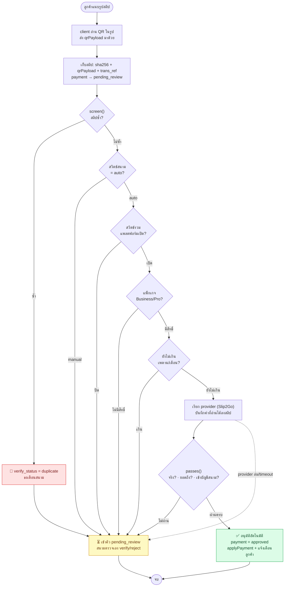

# การตรวจสลิป (Slip Verification) — Flow

ที่มาที่ไป การทำงาน และการตั้งค่าของระบบตรวจสลิปโอนเงิน ตั้งแต่ลูกค้าแนบสลิป
จนถึงการอนุมัติ (เอง หรืออัตโนมัติผ่าน API ผู้ให้บริการ)

> อัปเดตล่าสุด: 2026-08-11 · โค้ดหลัก: `App\Services\SlipVerificationService`

---

## 1. หลักการ

- **ตรวจสลิปเอง (manual) เป็นฟีเจอร์พื้นฐาน** ทุกแพ็กเกจใช้ได้ — สนามรับโอน
  แล้วกดอนุมัติเองในหน้า `owner/payments` เสมอ
- **ตรวจสลิปอัตโนมัติ (auto) เป็นฟีเจอร์เสริมที่มีต้นทุนต่อครั้ง** (ผู้ให้บริการ
  เช่น Slip2Go คิดเงิน/โทเคนต่อการเช็ค 1 สลิป) จึงถูกคุมหลายชั้น
- **ผู้ให้บริการตรวจสลิปเป็นการเชื่อมต่อระดับแพลตฟอร์ม** — บัญชีเดียว จ่ายโดยผู้ให้
  บริการระบบ (admin) ทุกสนามใช้ร่วมกัน สนาม (owner) ไม่เอา key ตัวเองมาเสียบ
- **ไม่ชัวร์ = เข้าคิวตรวจเอง เสมอ** — provider ล่ม / อ่านไม่ออก / ยอดไม่พอ /
  ผิดบัญชี ทุกกรณีตกไปให้คนตรวจ ไม่มีการอนุมัติผิดแบบเงียบๆ

---

## 2. สามชั้นการควบคุม

| ระดับ | คุมอะไร | อยู่ที่ไหน |
|---|---|---|
| **Admin** (แพลตฟอร์ม) | เชื่อมต่อ provider (driver/key/endpoint) | `admin/settings` → แท็บการชำระเงิน (เก็บใน `platform_settings`, key เข้ารหัส) |
| **Admin** (แพลตฟอร์ม) | **สวิตช์รวม** เปิด/ปิดทั้งระบบ | `platform_settings.slip_verify_enabled` |
| **Admin** (แพลตฟอร์ม) | ใครมีสิทธิ์ใช้ (ต่อแพ็กเกจ) | ฟีเจอร์ `slip_auto_verify` → Business/Pro (`plan_features`) |
| **Owner** (สนาม) | เปิด/ปิดของสนามตัวเอง | `organization_settings.slip_verify_mode` = `manual` \| `auto` |

---

## 3. Flow ภาพรวม



<details>
<summary>เวอร์ชัน ASCII (เผื่อ render Mermaid ไม่ได้)</summary>

```
ลูกค้า                        ระบบ                              สนาม/แอดมิน
  │                            │                                   │
  │ 1. สร้าง Payment           │                                   │
  │   (awaiting_slip)          │                                   │
  ├───────────────────────────►│                                   │
  │                            │                                   │
  │ 2. แนบรูปสลิป              │                                   │
  │   (client อ่าน QR ในรูป)   │                                   │
  ├───────────────────────────►│                                   │
  │                            │ 3. เก็บสลิป + sha256 + qrPayload   │
  │                            │    payment → pending_review        │
  │                            │                                   │
  │                            │ 4. screen(): เช็คสลิปซ้ำ ───────┐  │
  │                            │                                │  │
  │                            │ 5. gate 4 ชั้น (ดูข้อ 5) ───────┤  │
  │                            │                                │  │
  │                            │ 6a. ผ่านครบ → เรียก provider    │  │
  │                            │     ผ่านเกณฑ์ → อนุมัติเอง ──────┼─►│ (แจ้งเตือน)
  │                            │                                │  │
  │                            │ 6b. ไม่ผ่าน/ไม่ชัวร์            │  │
  │                            │     → เข้าคิว pending_review ───┴─►│ 7. ตรวจเอง
  │                            │                                   │    verify/reject
```

</details>

โค้ด: `PaymentController::uploadSlip()` → `SlipVerificationService::process()`

---

## 4. การกันสลิปซ้ำ (dedupe) — `screen()`

ทำงาน**ทุกแพ็กเกจ ทุกโหมด** (แม้ปิด auto) เพราะไม่ต้องเรียก API ข้างนอก

- สลิปโอนจริง 1 รายการ = 1 transaction ที่ไม่ซ้ำ การเอาสลิปเดิมมายื่นซ้ำจะจับได้จาก:
  - **`sha256`** ของไฟล์ → จับกรณีอัปโหลดไฟล์เดิมเป๊ะ
  - **`trans_ref`** (มาจาก QR payload) → จับกรณีเซฟรูปใหม่/แคปหน้าจอของ transaction เดิม
- เจอซ้ำ (ในสนามเดียวกัน คนละ payment ที่ approved/pending_review) → ตั้ง
  `verify_status = duplicate` แล้ว **ไม่อนุมัติอัตโนมัติ** (ธงเตือนให้สนามตัดสินเอง
  ในหน้า payments — ไม่ได้บล็อกแข็ง เพราะบางเคสลูกค้าโอนจริงหลายรอบ)

---

## 5. เงื่อนไขก่อนตรวจอัตโนมัติ (gate) — `process()`

ตรวจตามลำดับ ต้องผ่าน**ครบทุกข้อ**จึงจะเรียก provider:

1. **ไม่ใช่สลิปซ้ำ** (`screen()` ไม่เจอ) และ payment ยัง `pending_review`
   (กันอนุมัติซ้ำ — idempotency)
2. **สวิตช์สนาม** `slip_verify_mode === 'auto'` (owner เปิด)
3. **สวิตช์รวมแพลตฟอร์ม** `slip_verify_enabled` (admin เปิด) — ปิดที่นี่ = ทุกสนามหยุด
4. **แพ็กเกจอนุญาต** `PlanFeatures::allows(org, 'slip_auto_verify')` (Business/Pro)
5. **ยังไม่เกินเพดานเดือน** — นับ provider call เดือนนี้ < `MONTHLY_AUTO_LIMIT` (1000)
   กันค่าใช้จ่ายบานปลาย เกินแล้วตกไปตรวจเองจนสิ้นเดือน

ไม่ผ่านข้อไหน → return เงียบๆ สลิปคงอยู่ในคิว `pending_review` ให้ตรวจเอง

---

## 6. การตรวจกับ provider + เกณฑ์อนุมัติ

เรียก `SlipVerifier::verify($slip)` (ส่ง `qr_payload` ไปที่ผู้ให้บริการ) แล้วบันทึกค่าที่
อ่านได้ (`verified_amount`, `sender_name`, `receiver_ref`, `trans_ref`) ลงสลิปเสมอ —
ใช้ pre-fill ตอนตรวจเองด้วย

**อนุมัติอัตโนมัติเมื่อผ่านครบ 3 ข้อ** (`passes()`):

1. **สลิปจริง** — provider ตอบว่าอ่านได้/สำเร็จ (`ok`)
2. **ยอดถึง** — `verified_amount ≥ payment.amount`
3. **เข้าบัญชีสนามเอง** — เลข 4 ตัวท้ายของผู้รับในสลิป ตรงกับ `promptpay_id` /
   `bank_account_number` ที่สนามตั้งไว้ (`receiverMatches()`)

ผ่าน → `payment.status = approved` + `DepositService::applyPayment()` (เส้นทางเดียว
กับการอนุมัติเอง points/ใบเสร็จ/ยืนยันจึงเกิดครั้งเดียว) + แจ้งเตือนลูกค้า +
`verify_status = verified`

ไม่ผ่าน / provider throw → **fallback ไปตรวจเอง** (log warning ไม่ throw ต่อ ไม่บล็อก
ลูกค้า)

---

## 7. Provider driver (seam)

โครงแบบ interface + driver สลับได้ด้วย config — เพิ่มเจ้าใหม่ไม่ต้องแตะ caller

- `App\Services\Slip\SlipVerifier` (interface) — `verify(PaymentSlip): SlipVerification`
- `NullSlipVerifier` — default, คืน fail() (ระบบ inert จนกว่าจะเชื่อม provider จริง)
- `Slip2GoVerifier` — เจ้าที่ใช้จริง (REST, sync)
- `SlipOkVerifier` — อีกทางเลือก
- bind ตาม `platform_settings.slip_verify_driver` (fallback `config('services.slip.*')`
  จาก `.env` สำหรับ local/CI) ที่ `AppServiceProvider::slipProviderConfig()`

**Slip2Go**: `POST /api/verify-slip/qr-code/info` body `{"payload":{"qrCode": ...}}`
header `Authorization: Bearer <secret>` · สำเร็จเมื่อ `code` ขึ้นต้น `2000` · map
`data.{amount, transRef, dateTime, sender.account.name, receiver.account.*}`

---

## 8. Data model

**`payment_slips`** (ฟิลด์ที่เกี่ยวกับการตรวจ):

| ฟิลด์ | ความหมาย |
|---|---|
| `sha256` | แฮชไฟล์ — dedupe แบบไฟล์เดิม |
| `qr_payload` | ข้อมูลใน QR (client อ่านตอนอัปโหลด) — ส่งให้ provider |
| `trans_ref` | เลขอ้างอิงรายการ — dedupe ข้ามรูป / มาจาก provider |
| `verify_status` | `unchecked` \| `duplicate` \| `verified` |
| `verify_source` | `hash` \| `qr` \| ชื่อ driver (`slip2go`…) \| `manual` |
| `verified_amount`, `sender_name`, `receiver_ref` | ค่าที่อ่านจากสลิป |
| `verify_payload` | response ดิบจาก provider (json) — ไว้ debug/จูน mapping |

**`platform_settings`** (admin): `slip_verify_enabled`, `slip_verify_driver`,
`slip_verify_endpoint`, `slip_verify_key` (เข้ารหัส, write-only)

**`organization_settings`** (owner): `slip_verify_mode`

---

## 9. การตั้งค่า (สำหรับแอดมินแพลตฟอร์ม)

1. **สมัคร Slip2Go** เอา API Secret จากเมนู **API Connect → Authentication**
   (ใช้ **REST API** ไม่ใช่ Queue API ซึ่งเป็น async)
2. `admin/settings` → แท็บการชำระเงิน → การ์ด "ตรวจสลิปอัตโนมัติ (Slip2Go)":
   - เปิดสวิตช์รวม
   - ผู้ให้บริการ = **Slip2Go**
   - วาง **API Secret**
   - **Endpoint** เว้นว่างได้ถ้าใช้ค่าเริ่มต้น
     (`https://connect.slip2go.com/api/verify-slip/qr-code/info`)
3. ให้สิทธิ์แพ็กเกจ Business/Pro (มีอยู่แล้วผ่านฟีเจอร์ `slip_auto_verify`)

**สำหรับสนาม (owner):** `owner/settings` → หน้าจ่ายเงิน → เปิดสวิตช์ "ตรวจสลิป
อัตโนมัติ" (ต้องแพ็กเกจ Business/Pro) + ตั้งเลขบัญชี/PromptPay ให้ตรง

> ทางเลือก dev/CI: ตั้งผ่าน `.env` แทน DB ได้ — `SLIP_VERIFY_ENABLED=true`,
> `SLIP_VERIFY_DRIVER=slip2go`, `SLIP_VERIFY_KEY=...` (แล้ว `php artisan config:clear`)

---

## 10. ไฟล์ที่เกี่ยวข้อง

| ส่วน | ไฟล์ |
|---|---|
| Orchestration + gate + dedupe | `backend/app/Services/SlipVerificationService.php` |
| Driver interface + Slip2Go/SlipOK/Null | `backend/app/Services/Slip/*` |
| DTO | `backend/app/Support/SlipVerification.php` |
| Provider binding | `backend/app/Providers/AppServiceProvider.php` |
| อัปโหลด/derive trans_ref | `backend/app/Http/Controllers/Api/PaymentController.php` |
| Owner toggle (gated route) | `backend/app/Http/Controllers/Api/Owner/SettingController.php` |
| Admin connection + master switch | `backend/app/Http/Controllers/Api/Admin/SettingController.php` |
| Plan feature | `backend/app/Support/PlanCatalogue.php` (`slip_auto_verify`) |
| Client อ่าน QR | `frontend/lib/api/http.ts` (`readSlipQr`) |
| Owner UI (ค่าที่อ่านได้ + ธงซ้ำ) | `frontend/app/owner/payments/page.tsx` |
| Tests | `backend/tests/Feature/Slip{Dedupe,AutoVerify}Test.php`, `Slip2GoVerifierTest.php`, `SlipOkVerifierTest.php` |
