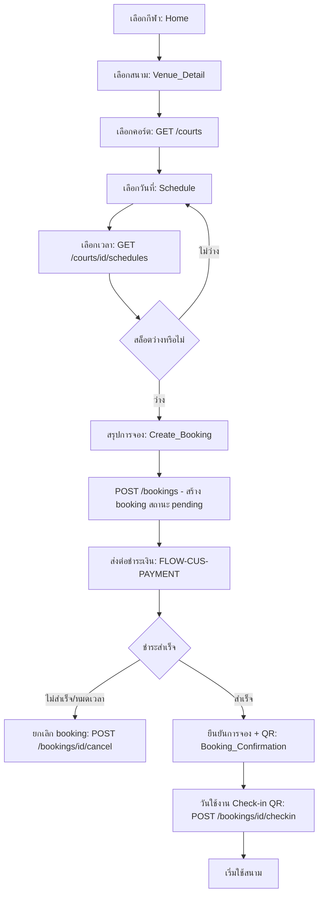

# Booking Flow

## Objective
ให้ลูกค้าจองคอร์ตสนามกีฬาแบบครบวงจร 9 ขั้นตอน ตั้งแต่เลือกกีฬาจนถึง Check-in ด้วย QR โดยตรวจสอบสล็อตว่าง สรุปยอด ส่งต่อชำระเงิน และยืนยันการจองได้อย่างถูกต้อง

## Actors
- ลูกค้า (Customer)
- ระบบ Booking / Schedule ของ SanamSpace
- ระบบ Payment (ส่งต่อใน Payment Flow)
- เจ้าหน้าที่หน้างาน (Reception — ตอน Check-in)

## Preconditions
- ลูกค้าเข้าสู่ระบบแล้ว (ดู FLOW-CUS-LOGIN) และมี session ผูก organization_id
- สนามมี Venue/Court และ Schedule ที่เปิดให้จอง

## Flow Steps
1. เลือกกีฬา (Sport) จากหน้า Home
2. เลือกสนาม/สาขา (Venue) — ดูรายละเอียดจาก Venue_Detail
3. เลือกคอร์ต (Court) — `GET /courts` แสดง Court_List/Court_Detail
4. เลือกวันที่ (Date) บนปฏิทิน (Schedule)
5. เลือกช่วงเวลา (Time slot) — `GET /courts/{id}/schedules` ตรวจสล็อตว่าง
6. ดูหน้าสรุป (Summary) ราคา/เวลา/คอร์ต ที่ Create_Booking → `POST /bookings`
7. ส่งต่อไปชำระเงิน (Payment handoff) — เข้าสู่ FLOW-CUS-PAYMENT
8. ยืนยันการจอง (Confirmation) — Booking_Confirmation แสดงสถานะและ QR
9. วันใช้งานจริง Check-in ด้วย QR ที่หน้างาน — `POST /bookings/{id}/checkin`

## Diagram

## Alternate & Error Paths
- สล็อตถูกจองโดยคนอื่นก่อน (race condition) → ระบบแจ้งเต็มและให้เลือกเวลาใหม่
- ไม่ชำระเงินภายในเวลาที่กำหนด → booking หมดอายุและถูก cancel อัตโนมัติ (`POST /bookings/{id}/cancel`)
- QR ไม่ถูกต้อง/เลยเวลา Check-in → เจ้าหน้าที่ตรวจสอบใน Owner Booking Management
- เครือข่าย/`POST /bookings` ล้มเหลว → แสดง Error_State พร้อม Retry ไม่หักสล็อต

## API Dependencies
- `GET /api/v1/courts` — รายการคอร์ต
- `GET /api/v1/courts/{id}/schedules` — ตารางเวลา/สล็อตว่าง
- `POST /api/v1/bookings` — สร้างการจอง
- `POST /api/v1/payments` (+ flow การชำระเงิน — ดู FLOW-CUS-PAYMENT)
- `POST /api/v1/bookings/{id}/checkin` — เช็คอินด้วย QR
- `POST /api/v1/bookings/{id}/cancel` — ยกเลิกเมื่อชำระไม่สำเร็จ

## Success Criteria
- ลูกค้าได้ booking สถานะ confirmed หลังชำระเงินสำเร็จ
- ไม่มีการจองสล็อตซ้ำซ้อน (double booking)
- ลูกค้าได้ QR สำหรับ Check-in และเช็คอินสำเร็จที่หน้างาน
