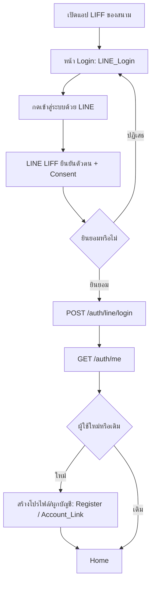

# Customer Login Flow

## Objective
ให้ลูกค้าเข้าสู่ระบบผ่าน LINE LIFF Login ได้อย่างรวดเร็ว ยืนยันตัวตน สร้างโปรไฟล์ครั้งแรก และเข้าสู่หน้า Home โดยข้อมูลทั้งหมดผูกกับ organization_id ของสนาม (multi-tenant)

## Actors
- ลูกค้า (Customer / ผู้ใช้สนาม)
- LINE LIFF / LINE Login Platform (ผู้ให้บริการยืนยันตัวตน)
- ระบบ Backend Auth ของ SanamSpace

## Preconditions
- ลูกค้ามีบัญชี LINE และเปิดแอปผ่าน LIFF URL ของสนามนั้น ๆ
- organization_id ของสนามถูกระบุจาก LIFF context
- LINE Login Channel ของ organization ถูกตั้งค่าและ active

## Flow Steps
1. ลูกค้าเปิดแอป (LIFF) จากลิงก์/LINE OA ของสนาม → หน้า Login (LINE_Login)
2. กดปุ่ม "เข้าสู่ระบบด้วย LINE" → ระบบเรียก LINE LIFF เพื่อยืนยันตัวตน
3. ลูกค้าให้ความยินยอม (Consent) สิทธิ์การเข้าถึงโปรไฟล์ LINE
4. ระบบส่ง LINE token ไป `POST /auth/line/login` เพื่อแลก session/token ของ SanamSpace
5. ระบบเรียก `GET /auth/me` เพื่อตรวจสถานะบัญชี
6. ถ้าเป็นผู้ใช้ใหม่ (first time) → ไปหน้าสร้างโปรไฟล์ / ผูกบัญชี (Register / Account_Link) กรอกชื่อ-เบอร์โทร แล้วบันทึก
7. ถ้าเป็นผู้ใช้เดิม → ข้ามขั้นสร้างโปรไฟล์
8. ระบบนำลูกค้าเข้าสู่หน้า Home พร้อมข้อมูลโปรไฟล์และ session

## Diagram

## Alternate & Error Paths
- ลูกค้าปฏิเสธ Consent → กลับสู่หน้า Login ไม่สร้าง session
- LINE token หมดอายุ/ไม่ถูกต้อง → `POST /auth/line/login` ตอบ error → แสดงข้อความและให้ลองใหม่
- เครือข่ายล้มเหลวระหว่างเรียก API → แสดง Error_State พร้อมปุ่ม Retry
- กรอกข้อมูลโปรไฟล์ไม่ครบ/เบอร์โทรซ้ำ → validation error ที่หน้า Register

## API Dependencies
- `POST /api/v1/auth/line/login` — แลก LINE token เป็น session ของระบบ
- `GET /api/v1/auth/me` — ดึงข้อมูลโปรไฟล์/สถานะผู้ใช้ปัจจุบัน

## Success Criteria
- ลูกค้าได้ session/token ที่ถูกต้องและผูกกับ organization_id
- ผู้ใช้ใหม่มีโปรไฟล์ในระบบหลังจบ flow
- ลูกค้าเข้าถึงหน้า Home ได้สำเร็จภายในไม่กี่วินาที
