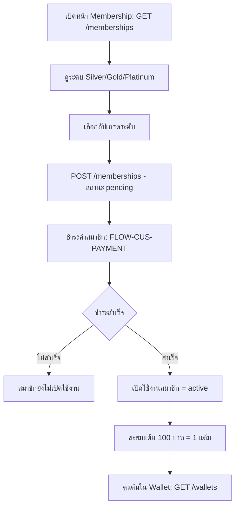

# Membership Flow

## Objective
ให้ลูกค้าดูระดับสมาชิก (Silver/Gold/Platinum) อัปเกรด ชำระเงิน และเปิดใช้งานสมาชิก พร้อมสะสมแต้มอัตโนมัติจากการใช้จ่าย (100 บาท = 1 แต้ม) เข้าสู่ Wallet

## Actors
- ลูกค้า (Customer)
- ระบบ Membership / Wallet ของ SanamSpace
- ระบบ Payment (ส่งต่อใน Payment Flow)

## Preconditions
- ลูกค้าเข้าสู่ระบบแล้ว (ดู FLOW-CUS-LOGIN)
- สนามเปิดฟีเจอร์ Membership (แพ็กเกจ Business ขึ้นไป) และตั้งค่าระดับสมาชิกไว้

## Flow Steps
1. ลูกค้าเปิดหน้า Membership ดูระดับและสิทธิประโยชน์ — `GET /memberships`
2. เลือกระดับที่ต้องการอัปเกรด (Silver → Gold → Platinum)
3. ยืนยันการสมัคร/อัปเกรด → `POST /memberships` (สร้างคำขอสถานะ pending)
4. ชำระเงินค่าสมาชิก — เข้าสู่ FLOW-CUS-PAYMENT
5. เมื่อชำระสำเร็จ ระบบเปิดใช้งานสมาชิก (active) และอัปเดตระดับ
6. ระบบสะสมแต้มเข้าสู่ Wallet ตามการใช้จ่าย (100 บาท = 1 แต้ม) — `GET /wallets`

## Diagram

## Alternate & Error Paths
- ชำระเงินไม่สำเร็จ → membership คงสถานะเดิม ไม่อัปเกรด
- ลูกค้ามีระดับสูงกว่าอยู่แล้ว → ไม่อนุญาต downgrade ผ่าน flow นี้ แสดงข้อความ
- สนามไม่ได้เปิดฟีเจอร์ Membership → ซ่อนเมนู/แสดง Empty_State
- การคำนวณแต้มล้มเหลว → บันทึก ledger ค้างไว้และ retry ผ่าน queue

## API Dependencies
- `GET /api/v1/memberships` — ดูระดับสมาชิกและสิทธิประโยชน์
- `POST /api/v1/memberships` — สมัคร/อัปเกรดสมาชิก
- `GET /api/v1/wallets` — ดูยอดแต้มสะสมใน Wallet

## Success Criteria
- สมาชิกเปลี่ยนเป็นระดับใหม่และสถานะ active หลังชำระเงิน
- แต้มสะสมถูกบันทึกถูกต้อง (100 บาท = 1 แต้ม) ผ่าน Wallet ledger
- ลูกค้าเห็นระดับและแต้มล่าสุดในแอป
