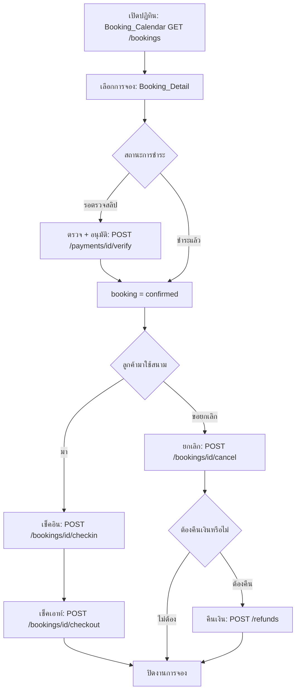

# Owner Booking Management

## Objective
ให้เจ้าหน้าที่ (Reception/Manager) จัดการการจองจากปฏิทิน อนุมัติ/ตรวจสลิป เช็คอิน-เช็คเอาท์ ยกเลิกและคืนเงิน เพื่อบริหารหน้างานได้ครบถ้วนภายในสิทธิ์ของแต่ละ role

## Actors
- Reception (จัดการ booking, check-in/out, ลูกค้า)
- Manager (verify การชำระ, approve refund)
- Cashier (refund/wallet — กรณีคืนเงิน)
- ระบบ Booking / Payment / Refund ของ SanamSpace

## Preconditions
- เจ้าหน้าที่เข้าสู่ระบบ Owner Portal และมี role ที่มีสิทธิ์ตาม Permission Matrix
- มีการจองในระบบ (status pending/confirmed) ของ organization

## Flow Steps
1. เจ้าหน้าที่เปิดปฏิทินการจอง (Booking_Calendar) — `GET /bookings`
2. เลือกการจองเพื่อดูรายละเอียด (Booking_Detail)
3. ตรวจสลิป/อนุมัติการชำระ (Manager) — `POST /payments/{id}/verify`
4. วันใช้งาน: เช็คอินลูกค้า — `POST /bookings/{id}/checkin`
5. เมื่อใช้สนามเสร็จ: เช็คเอาท์ — `POST /bookings/{id}/checkout`
6. กรณีลูกค้าขอยกเลิก: ยกเลิกการจอง — `POST /bookings/{id}/cancel`
7. ถ้าต้องคืนเงิน: สร้างคำขอคืนเงินและอนุมัติ — `POST /refunds`

## Diagram

## Alternate & Error Paths
- role ไม่มีสิทธิ์ (เช่น Reception ตรวจสลิปไม่ได้) → ปุ่มถูกซ่อน/แสดง 403 ตาม Permission Matrix
- สลิปไม่ถูกต้อง → `reject` แทน verify และแจ้งลูกค้า
- เช็คอินซ้ำ/เลยเวลา → ระบบเตือนและบันทึก audit log
- คืนเงินต้องผ่าน approve (Manager/Cashier) ก่อนทำจริง — `POST /refunds/{id}/approve`

## API Dependencies
- `GET /api/v1/bookings` — รายการ/ปฏิทินการจอง
- `POST /api/v1/payments/{id}/verify` — อนุมัติการชำระ/ตรวจสลิป
- `POST /api/v1/bookings/{id}/checkin` — เช็คอิน
- `POST /api/v1/bookings/{id}/checkout` — เช็คเอาท์
- `POST /api/v1/bookings/{id}/cancel` — ยกเลิกการจอง
- `POST /api/v1/refunds` (+ `POST /api/v1/refunds/{id}/approve`) — คืนเงิน

## Success Criteria
- เจ้าหน้าที่จัดการการจองได้ตามสิทธิ์ของ role โดยไม่ข้าม tenant
- สถานะการจอง/การชำระอัปเดตถูกต้องและบันทึก audit log
- การคืนเงินผ่านการอนุมัติก่อนดำเนินการเสมอ
