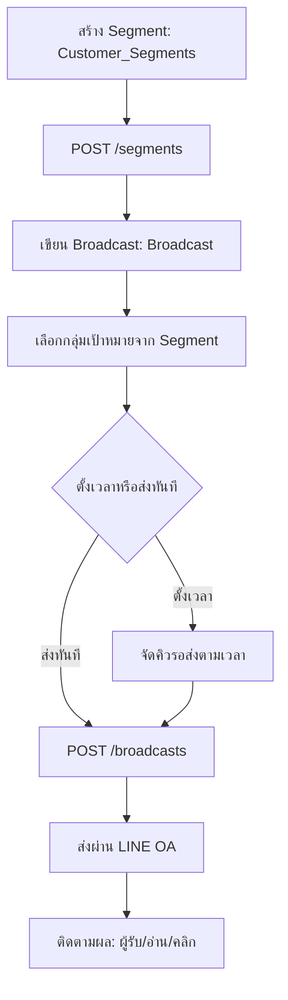

# Owner CRM Flow

## Objective
ให้ทีม Marketing สร้างกลุ่มลูกค้า (Segment) เขียนข้อความ Broadcast ตั้งเวลา/ส่งผ่าน LINE OA และติดตามผลการส่ง เพื่อทำการตลาดแบบเจาะกลุ่ม (ฟีเจอร์แพ็กเกจ Pro ขึ้นไป)

## Actors
- Marketing (สิทธิ์ CRM/Broadcast — Full ตาม Permission Matrix)
- Manager/Owner (กำกับดูแล)
- ระบบ CRM / Notification ของ SanamSpace
- LINE Official Account (ช่องทางส่ง)

## Preconditions
- เข้าสู่ระบบ Owner Portal ด้วย role ที่มีสิทธิ์ CRM/Broadcast
- organization อยู่ในแพ็กเกจ Pro ขึ้นไป (เปิด CRM/Broadcast)
- LINE OA ของ organization เชื่อมต่อแล้ว

## Flow Steps
1. สร้างกลุ่มลูกค้า (Customer_Segments) ตามเงื่อนไข เช่น ความถี่การจอง/ระดับสมาชิก — `GET /segments`, `POST /segments`
2. เขียนข้อความ Broadcast (Broadcast) แนบรูป/ปุ่ม CTA
3. เลือกกลุ่มเป้าหมายจาก Segment ที่สร้าง
4. ตั้งเวลาส่งหรือส่งทันที → `POST /broadcasts` ส่งผ่าน LINE OA
5. ติดตามผลการส่ง (จำนวนผู้รับ/อ่าน/คลิก) ในหน้าติดตาม

## Diagram

## Alternate & Error Paths
- organization ไม่อยู่แพ็กเกจ Pro → ฟีเจอร์ถูกล็อก แสดง upsell
- Segment ว่าง (ไม่มีลูกค้าตรงเงื่อนไข) → เตือนและไม่ให้ส่ง
- เกินโควต้าข้อความ LINE OA → ระบบหยุดส่งและแจ้งเตือน
- LINE OA หลุดการเชื่อมต่อ → broadcast ล้มเหลว บันทึก error และให้ retry
- role ไม่มีสิทธิ์ Broadcast → ปุ่มถูกซ่อนตาม Permission Matrix

## API Dependencies
- `GET /api/v1/segments` — รายการกลุ่มลูกค้า
- `POST /api/v1/segments` — สร้าง/บันทึกกลุ่มลูกค้า
- `POST /api/v1/broadcasts` — ส่ง/ตั้งเวลา Broadcast ผ่าน LINE OA

## Success Criteria
- สร้าง Segment และส่ง Broadcast ถึงกลุ่มเป้าหมายสำเร็จผ่าน LINE OA
- มีข้อมูลติดตามผลการส่ง (delivered/read) ให้ Marketing ดู
- ทำงานภายในสิทธิ์ role และ tenant ของ organization
