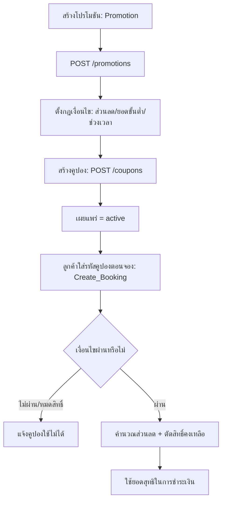

# Owner Promotion Flow

## Objective
ให้ทีม Marketing สร้างโปรโมชัน/คูปอง ตั้งเงื่อนไขการใช้งาน เผยแพร่ และให้ลูกค้านำคูปองมาใช้ตอนจอง เพื่อกระตุ้นยอดและรักษาฐานลูกค้า

## Actors
- Marketing (สิทธิ์ Promotion — Full ตาม Permission Matrix)
- Manager/Owner (กำกับดูแล)
- ลูกค้า (ผู้ใช้คูปองตอนจอง)
- ระบบ Promotion / Coupon / Booking ของ SanamSpace

## Preconditions
- เข้าสู่ระบบ Owner Portal ด้วย role ที่มีสิทธิ์ Promotion
- organization เปิดฟีเจอร์ Promotion (แพ็กเกจ Business ขึ้นไป)

## Flow Steps
1. สร้างโปรโมชัน/คูปอง (Promotion) — `GET /promotions`, `POST /promotions`
2. ตั้งกฎเงื่อนไข เช่น ส่วนลด %/บาท, ยอดขั้นต่ำ, ช่วงเวลา, จำนวนสิทธิ์, กีฬา/คอร์ตที่ใช้ได้
3. สร้างรหัสคูปอง (Coupon) ผูกกับโปรโมชัน — `GET /coupons`, `POST /coupons`
4. เผยแพร่ (publish) โปรโมชันให้ active
5. ลูกค้าใส่รหัสคูปองตอนจอง (Create_Booking) → ระบบตรวจสอบเงื่อนไขและให้ส่วนลด
6. ระบบบันทึกการใช้คูปองและตัดจำนวนสิทธิ์คงเหลือ

## Diagram

## Alternate & Error Paths
- คูปองหมดอายุ/หมดสิทธิ์/ไม่ตรงเงื่อนไข → แจ้งลูกค้าและไม่ให้ส่วนลด
- ยอดต่ำกว่าขั้นต่ำที่กำหนด → คูปองใช้ไม่ได้
- ใช้คูปองซ้ำเกินสิทธิ์ต่อคน → ระบบปฏิเสธ
- organization ไม่เปิดฟีเจอร์ Promotion → ฟีเจอร์ถูกล็อก
- role ไม่มีสิทธิ์ Promotion → ปุ่มถูกซ่อนตาม Permission Matrix

## API Dependencies
- `GET /api/v1/promotions` — รายการโปรโมชัน
- `POST /api/v1/promotions` — สร้างโปรโมชัน
- `GET /api/v1/coupons` — รายการคูปอง
- `POST /api/v1/coupons` — สร้างคูปอง

## Success Criteria
- โปรโมชัน/คูปอง active และใช้งานได้ตามกฎที่ตั้งไว้
- ลูกค้าใช้คูปองตอนจองได้และได้ส่วนลดถูกต้อง
- ระบบตัดจำนวนสิทธิ์และบันทึกการใช้คูปองครบถ้วน
