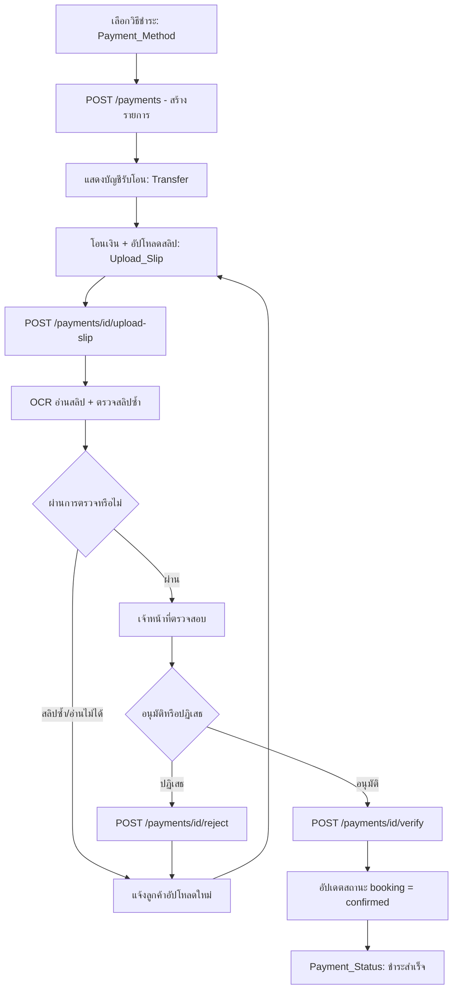

# Payment Flow

## Objective
ให้ลูกค้าชำระเงินค่าจองด้วยการโอนและอัปโหลดสลิป โดยระบบตรวจสลิปอัตโนมัติ (OCR + duplicate check) และให้เจ้าหน้าที่อนุมัติ เพื่ออัปเดตสถานะการชำระและยืนยันการจอง

## Actors
- ลูกค้า (Customer)
- ระบบ Payment / OCR ของ SanamSpace
- เจ้าหน้าที่ตรวจสลิป (Cashier / Manager — สิทธิ์ verify ตาม Permission Matrix)

## Preconditions
- มี booking สถานะ pending จาก FLOW-CUS-BOOKING พร้อมยอดที่ต้องชำระ
- สนามตั้งค่าบัญชีรับโอนไว้แล้ว

## Flow Steps
1. ลูกค้าเลือกวิธีชำระเงิน (Payment_Method) → ระบบสร้างรายการชำระ `POST /payments`
2. แสดงข้อมูลบัญชี/พร้อมเพย์ให้โอน (Transfer)
3. ลูกค้าโอนเงินผ่านแอปธนาคารแล้วอัปโหลดสลิป (Upload_Slip) → `POST /payments/{id}/upload-slip`
4. ระบบทำ OCR อ่านข้อมูลสลิปและตรวจสลิปซ้ำ (duplicate check)
5. ถ้าผ่านการตรวจ → ส่งให้เจ้าหน้าที่อนุมัติ → `POST /payments/{id}/verify`
6. ถ้าไม่ผ่าน/ข้อมูลไม่ตรง → เจ้าหน้าที่ปฏิเสธ → `POST /payments/{id}/reject`
7. ระบบอัปเดตสถานะการชำระและการจอง แสดงผลที่ Payment_Status

## Diagram

## Alternate & Error Paths
- สลิปซ้ำ (duplicate) หรือ OCR อ่านไม่ออก → ระบบปฏิเสธอัตโนมัติและให้อัปโหลดใหม่
- ยอดในสลิปไม่ตรงกับยอดที่ต้องชำระ → เจ้าหน้าที่ `reject` พร้อมเหตุผล
- อัปโหลดไฟล์ผิดประเภท/ใหญ่เกิน → validation error ที่ Upload_Slip
- ไม่อัปโหลดสลิปภายในเวลา → booking หมดอายุและถูกยกเลิก

## API Dependencies
- `POST /api/v1/payments` — สร้างรายการชำระเงิน
- `POST /api/v1/payments/{id}/upload-slip` — อัปโหลดสลิป
- `POST /api/v1/payments/{id}/verify` — เจ้าหน้าที่อนุมัติการชำระ
- `POST /api/v1/payments/{id}/reject` — ปฏิเสธการชำระ

## Success Criteria
- สถานะการชำระเปลี่ยนเป็น verified และ booking เป็น confirmed
- ตรวจจับสลิปซ้ำได้ ไม่อนุมัติซ้ำ
- ลูกค้าเห็นสถานะการชำระที่ถูกต้องที่ Payment_Status
